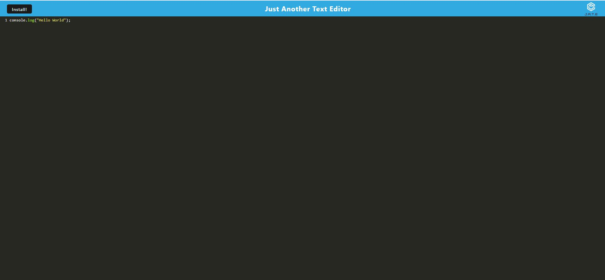

# Just Another Text Editor

## Description
JATE is a simple text editor application meets PWA critera and can function online and offline. The application uses a cache first approach and therefore access data in the indexed DB to populate the editor before accessing data in local storage. A developer is able to create code snippets in the text editor and while offline the text editor is able to be downloaded to ones desktop. 

## Table of Contents
- [Description](#description)
- [How to Use](#how-to-use)
- [Code Snippet](#code-snippet)
- [Technologies Used](#technologies-used)
- [Installation](#instalation)
- [Contact Information](#contact-information)


## How to Use
Visit the [deployed application](https://stark-beach-27936.herokuapp.com/) where you will be presented with a code/text editor. Any code or text you add will save automatically whenever you click off of the window. On refresh or revisit, the text is persistent and saved in IndexedDB.




## Code Snippet
The code snippet below shows how each card is generated. The one displayed is for the Engineer. Therefore, the data gathered from the command line is dynamically inputted into each respective area of the
html card. 

``` const getEngineer = (engineer) =>{
        return ` 
        <div class="card employee-card">
        <div class="card-header">
            <h2 class="card-title">${engineer.getName()}</h2>
            <h3 class="card-title"><i class="fas fa-glasses mr-2"></i>Engineer</h3>
        </div>
        <div class="card-body">
            <ul class="list-group">
                <li class="list-group-item">ID: ${engineer.getId()}</li>
                <li class="list-group-item">Email: <a href="mailto:${engineer.getEmail()}">${engineer.getEmail()}</a></li>
                <li class="list-group-item">GitHub: <a href="https://github.com/${engineer.getGitHub()}" target="_blank" rel="noopener noreferrer">${engineer.getGitHub()}</a></li>
            </ul>
        </div>
    </div>
     `;
    };
```

## Technologies Used
- Node.Js
- JavaScript
- Git
- GitHub
- HTML
- Boot Strap 

## Installation
- Inquirer
- Jest

## Contact Information 
- [GitHub](https://github.com/mkelly3/)
- [Linkedin](https://www.linkedin.com/in/morgan-kelly15/)