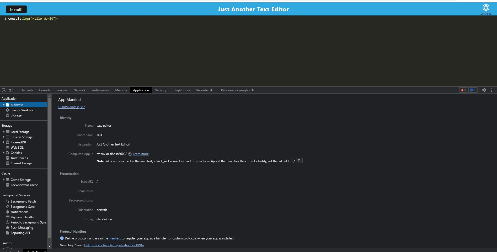

# Just Another Text Editor

## Description
JATE is a simple text editor application meets PWA critera and can function online and offline. The application uses a cache first approach and therefore access data in the indexed DB to populate the editor before accessing data in local storage. A developer is able to create code snippets in the text editor and while offline the text editor is able to be downloaded to ones desktop. 

## Table of Contents
- [Description](#description)
- [How to Use](#how-to-use)
- [Code Snippet](#code-snippet)
- [Technologies Used](#technologies-used)
- [Installation](#instalation)
- [Contact Information](#contact-information)


## How to Use
Visit the [deployed application](https://stark-beach-27936.herokuapp.com/) where you will be presented with a code/text editor. Any code or text you add will save automatically whenever you click off of the window. On refresh or revisit, the text is persistent and saved in IndexedDB.




## Code Snippet
In the Webpack-config.js added injectmanifest and WebpackPWA Manifest to generate a manifest.json. 

``` 
  new InjectManifest({
        swSrc: './src-sw.js',
        swDest: 'src-sw.js',
      }),
      new WebpackPwaManifest({
        fingerprints: false,
        inject: true,
        name: 'text-editor',
        short_name: 'JATE',
        description: 'Just Another Text Editor!',
        start_url: '/',
        publicPath: '/',
        icons: [
          {
            src: path.resolve('src/images/logo.png'),
            sizes: [96, 128, 192, 256, 384, 512],
            destination: path.join('assets', 'icons'),
          },
        ],
      }),
```

## Technologies Used
- Node.Js
- Express.js
- PWA
- Heroku 
- WebPack 
    - Service Workers
    - Create Manifest
- IndexedDB

## Installation
- Webpack-dev-server
- Workbox-webpack-plugin

## Contact Information 
- [GitHub](https://github.com/mkelly3/)
- [Linkedin](https://www.linkedin.com/in/morgan-kelly15/)